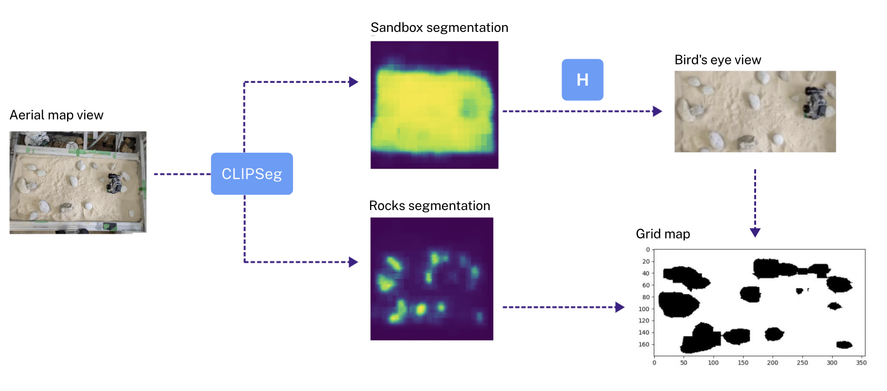
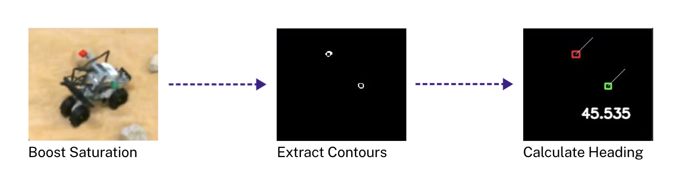
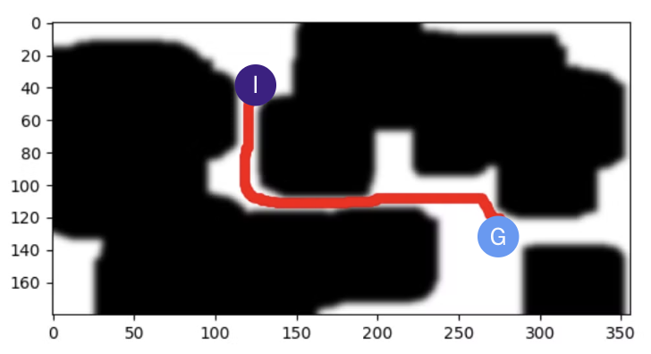

# Moon Rover
#### TESP 2024 - Space Robotics Lab

During TESP 2024, in the laboratory of space robotics directed by Prof. Yoshida, we were requested to build a rover to drive on the moon surface.

## The team
Our team was made up of 4 components, coming from different countries all over the world:
 - [Salvatore Michele Rago](https://github.com/salvatore373): La Sapienza University, Italy
 - [Trevor Wolf](https://github.com/wolfpaw682): Colorado School of Mines, USA
 - [Adrian Suliga](https://github.com/AdrianSuliga): AGH University of Kracow, Poland
 - Harsimret Dhami: Cranfield University, UK 

Supervisors: [Ellian Neppel](https://www.linkedin.com/in/elian-neppel/), [Gustavo Díaz](https://www.linkedin.com/in/gustavo-diaz-space-robotics/), Keisuke Takehana.

## The problem
The goal of this laboratory activity was to build a rover capable of moving in a sandbox from the initial position to the desired goal position, while avoidong the obstacles on the track. In our case, the only obstacles on the map were stones emulating the moon rocks.

## The robot
The rover was built using the LEGO Mindstorms kit. It has two front wheels connected to independent motors, and two rear wheels connected to the same motor.
We were also provided with an external RGB camera, from which we retrieve an aerial-like image of the environment.
Both the EV3 board mounted on the robot and the camera are directly connected to an external computer.

## Our solution
The solution that we proposed can be divided into four sections: Mapping, Localization, Path planning and Control.

## Mapping
The first thing to do is get from the aerial view of the environment a map in which path planning can be performed. For this purpose, the image taken from the camera is passed to a 0SHOT-Segmentation model, that identifies the position of the obstacles and the bounds of the sandbox. From the sandbox segmentation we extract its the corners, and use them to compute the homography transformation matrix that turns the aerial image taken by the camera into a bird's eye view. Then, we exploit the obstacles segmentation to get their position in the bird's eye view. By joining all those information, we can build a grid map that represents the environment.
We decided not to use ArUco markers to identify the rocks or sandbox bounds in order to develop a solution that could be potentially used in a real space mission. Furthermore, this solution is flexible, because any kind of obstacle can be detected by the 0SHOT-SEGMENTATION model, and is Independent from the point of view from which the aerial picture is taken.

## Localization 
Again, all we need to compute the pose of the robot on the map is an RGB image of the environment. Using computer vision techniques, we can extract the position of the green and red markers placed on the rover, figure out their arrangement and compute from that the position and orientation of the robot on the map.

## Path Planning
Once the map has been converted into a grid and the initial and desired final positions are defined, we have to find a path. We used the A* algorithm for this task. To ensure that the robot can navigate through gaps between obstacles, we inflate the obstacles in the grid. Additionally, a Guassian filter is applied to spread the cost of the obstacles in their neighborhood, keeping the rover as far as possible from them.
This method of path planning is very lightweight and fast, even if run on a device with limited resources like Raspberry Pi. Furthermore, the consistent heuristic we employed guarantees that the solution found will always be optimal.

## Control
We used a PD control law to command the robot, which, with minimal computation, allows us to react very fast to the error in position and orientation of the robot during navigation. We compute a proportional correction of the robot's position, heading, linear and angular velocity, and we send velocity commands that allow the rover to follow the desired trajectory.
